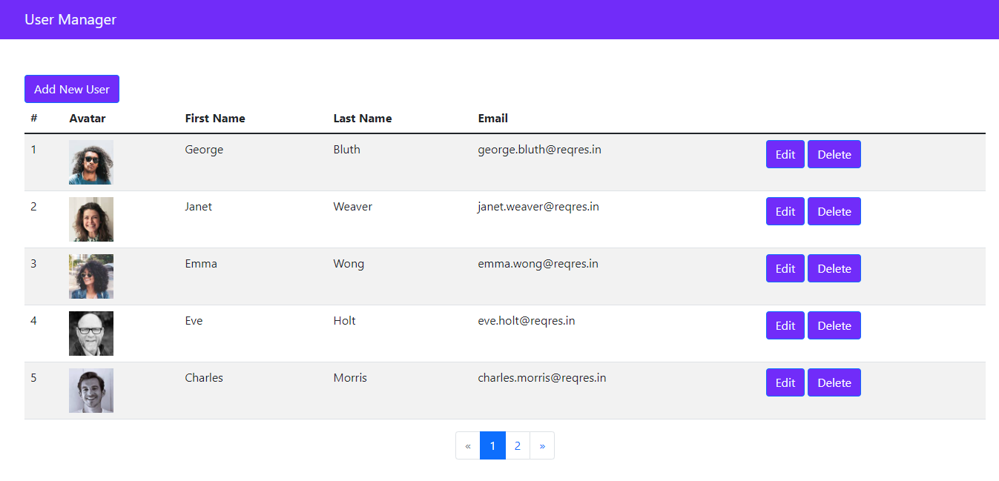
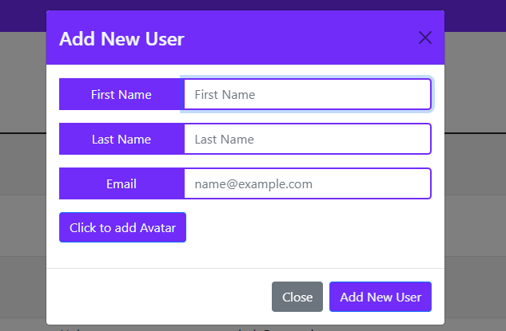
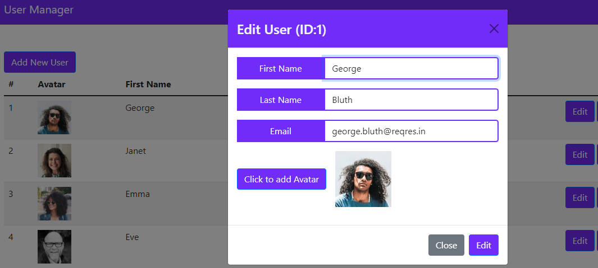
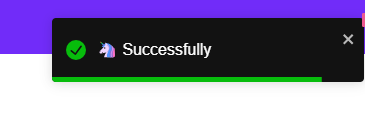

# DEMO: Website to manage User

This project uses APIs von https://reqres.in/ for testing and is built by ReactJS with the following features:
- Show list user
- Add new user
- Edit a user
- Delete a chosen user

used Libraries:
- ReactJS
- React Bootstrap to beautify the interface
- React Hook Form to manage and validate the Form
- React Toastify to add notifications 

# How to run
In the project directory, you can run:
### `npm install`
### `npm start`
The app will run in the development mode.\
Open [http://localhost:3000](http://localhost:3000) to view it in your browser.

# Images
### page interface

### form to create/edit a user

### using React toastify to inform a action

